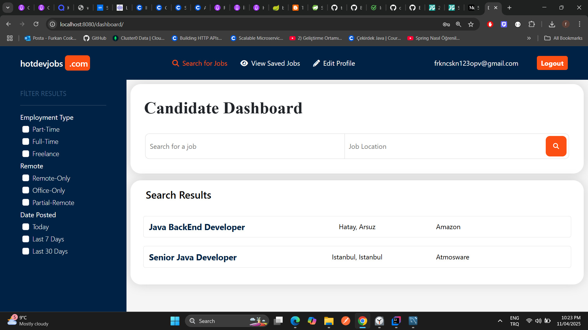

# JobPortal Web Uygulaması

JobPortal, iş arayanlar ile işverenleri bir araya getiren, Spring Boot tabanlı bir web uygulamasıdır. Kullanıcılar, profillerini oluşturabilir, iş ilanları yayınlayabilir ve başvuruları yönetebilirler.Kullanıcı kaydı yapmadan da işleri arıyabilir ve görebilirler.

Öncelikle kayıt olarak profilinizi oluşturmalı ve bilgilerinizi düzenlemelisiniz.İşe alım uzmanı olarak hesabınıza giriş yaptıktan sonra yeni bir iş ilanı oluşturabilir ve bunu yayınlayabilirsiniz.Daha sonra iş arayan hesabınızla sisteme giriş yaparak yayınlanan ilanlara başvurabilir ve özgeçmiş (CV) dosyanızı gönderebilirsiniz.
İşe alım uzmanı, hesabına giriş yaptığında başvuran adayların bilgilerini inceleyebilir ve gönderilen CV’leri indirebilir.İş ilanlarını görüntülemek için kayıt olmanız gerekmez. Ayrıca filtreleme özelliği sayesinde yalnızca ilgi alanınıza uygun iş ilanlarını listeleyebilirsiniz.


📌 **Not:** Bu projede sadece *backend* (arka uç) kısmı tarafımca kodlanmıştır. *Frontend* kısmı için dışarıdan hazır bir tema kullanılmıştır.

# Özellikler

- **Kullanıcı Kayıt ve Giriş:** İş arayanlar ve işverenler için ayrı kayıt ve giriş işlemleri.
- **Profil Yönetimi:** Kullanıcılar, kişisel bilgilerini güncelleyebilir ve özgeçmişlerini yükleyebilirler.
- **İş İlanı Yayınlama:** İşverenler, yeni iş ilanları oluşturabilir ve mevcut ilanları yönetebilirler.
- **İş Başvuruları:** İş arayanlar, ilanlara başvurabilir ve başvuru durumlarını takip edebilirler.
- **JWT ile Kimlik Doğrulama:** Güvenli oturum yönetimi için JSON Web Token (JWT) kullanımı.

# 🛠️ Kullanılan Teknolojiler

- **Backend:** Java 23, Spring Boot, Spring Security, Spring Data JPA
- **Veritabanı:** MySQL
- **Frontend:** Thymeleaf, HTML, CSS (Hazır olarak dışarıdan projeye dahil edimiştir "Frontend".)
- **Diğer:** Maven, JWT

# Proje Yapısı

```
jobportal-web-app/
├── src/
│   ├── main/
│   │   ├── java/
│   │   │   └── jobportal/
│   │   │       └── web/
│   │   │           └── app/
│   │   │               ├── config/
│   │   │               ├── controller/
│   │   │               ├── entity/
│   │   │               ├── repository/
│   │   │               ├── services/
│   │   │               └── util/
│   │   └── resources/
│   │       ├── templates/
│   │       └── application.properties
├── pom.xml
└── README.md





# ⚙️ Kurulum ve Çalıştırma

1. **Projeyi Klonlayın:**

   
   git clone https://github.com/coskun-furkan/jobportal-web-app.git
   cd jobportal-web-app
  

2. **Veritabanı Ayarlarını Yapın:**

   `src/main/resources/application.properties` dosyasını açarak kendi MySQL kullanıcı bilgilerinizi girin.

3. **Uygulamayı Başlatın:**

   bash için:
   
   mvn spring-boot:run
   
   veya
   
   Idea da projeyi açıp  çalıştırın
   

4. **Uygulamaya Erişim:**

   Tarayıcıdan `http://localhost:8080` adresine gidin.

#📄 Lisans

Bu proje [MIT Lisansı](LICENSE) ile lisanslanmıştır.

#🤝 Katkıda Bulunmak

Katkılarınızı memnuniyetle karşılıyoruz! Lütfen katkı sunmadan önce `CONTRIBUTING.md` dosyasını inceleyin.
